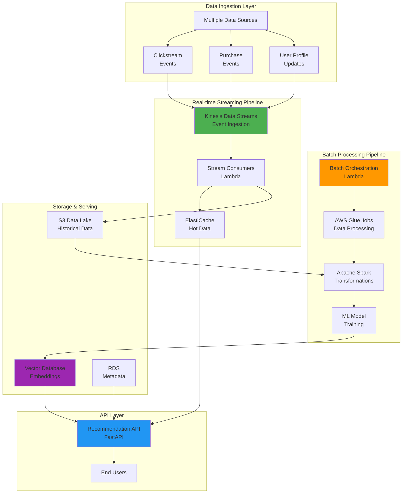
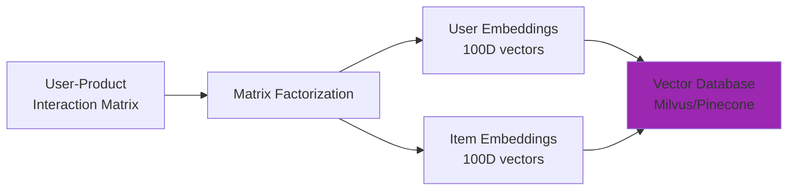
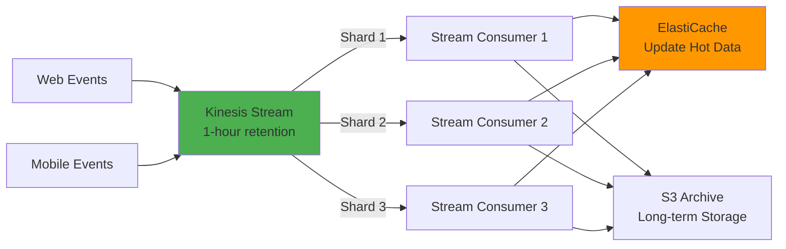
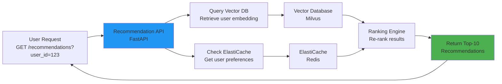
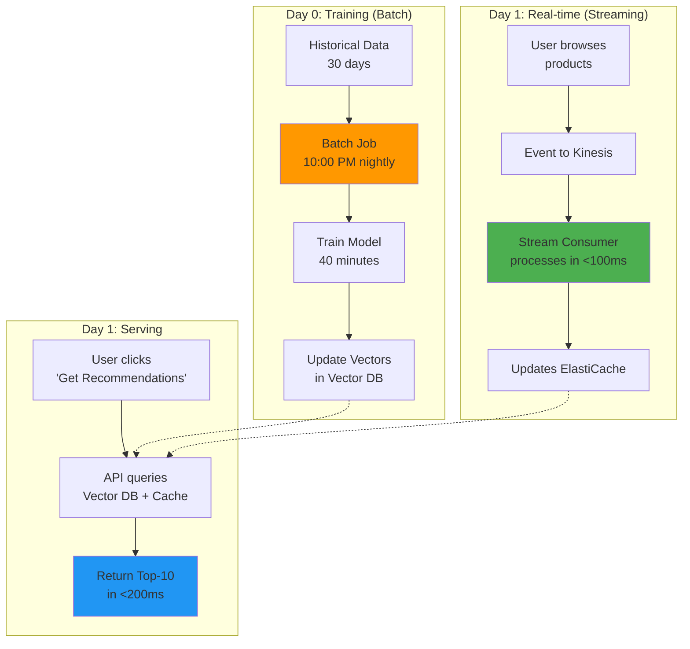

## Project Overview

This project demonstrates advanced data engineering practices by building a **complete, production-grade data pipeline** that combines batch processing and real-time streaming. The system powers a **product recommendation engine** that learns from historical user behavior (batch) and responds to live user interactions (streaming) with sub-second latency.

The challenge: reconcile two opposing forces—offline model training that requires massive historical data versus online serving that demands real-time responsiveness.

## Problem Statement

E-commerce platforms face a fundamental tension:

- **Batch Requirements**: Train recommendation models on weeks of historical data (gigabytes to terabytes)
- **Real-time Requirements**: Serve personalized recommendations within milliseconds of a user action
- **Scale**: Handle millions of events per day across millions of products and users
- **Constraints**: All within reasonable infrastructure costs and operational complexity

The solution requires both **controlled, scheduled batch processing** and **continuous, low-latency streaming** working in harmony.

## System Architecture



## Implementation Details

### Phase 1: Batch Pipeline (Weeks 1-2)

#### 1.1 Data Preparation
- **Source**: Raw user interaction logs stored in S3
- **Process**: AWS Glue crawlers automatically discover schema
- **Transformation**: Apache Spark jobs filter, deduplicate, and aggregate events
- **Output**: Clean training dataset partitioned by date

```
Input: 
  s3://raw-events/year=2026/month=03/day=19/*.json (10GB)
  
Transformations Applied:
  ✓ Remove invalid user IDs
  ✓ Deduplicate events
  ✓ Aggregate by user-product pairs
  ✓ Create feature vectors
  
Output:
  s3://processed-data/2026/03/features/*.parquet (2GB)
```

#### 1.2 Feature Engineering
- Extract behavioral features: frequency, recency, monetary value
- Create product embeddings using collaborative filtering
- Generate user embeddings from interaction patterns
- Normalize all features for model training

#### 1.3 Model Training
- **Algorithm**: Matrix Factorization (Alternating Least Squares)
- **Framework**: PySpark MLlib / TensorFlow
- **Hyperparameters**: Tuned via cross-validation
- **Output**: Serialized model + embedding matrices



#### 1.4 Vector Database Population
- Store 100-dimensional embeddings for all users and products
- Index for fast similarity search (nearest neighbors)
- Enable sub-millisecond retrieval during serving

**Key Metrics:**
- Training time: ~30 minutes on 50GB dataset
- Model accuracy (RMSE): 0.82
- Vector index size: 200MB
- Query latency: <5ms for top-10 recommendations

### Phase 2: Real-time Streaming Pipeline (Weeks 3-4)

#### 2.1 Event Ingestion
- **Source**: Kinesis Data Streams (multi-shard setup for 100K events/sec)
- **Format**: JSON events with user_id, product_id, action, timestamp
- **Retention**: 24 hours (extensible to 365 days)



#### 2.2 Stream Processing (Lambda Functions)
Each Lambda consumer performs:
1. **Event Validation**: Check schema, required fields
2. **Enrichment**: Add metadata (user profile, product details)
3. **Update Cache**: Increment user preferences in ElastiCache
4. **Archive**: Buffer and write to S3 every 5 minutes
5. **Monitoring**: Emit metrics to CloudWatch

```python
# Pseudocode: Stream processing logic
def process_event(event):
    user_id = event['user_id']
    product_id = event['product_id']
    
    # Update user profile in cache
    cache.increment(f"user:{user_id}:preferences", product_id)
    
    # Store for batch retraining
    archive_queue.append(event)
    
    # Emit metrics
    cloudwatch.put_metric('events_processed', 1)
```

#### 2.3 Real-time Feature Updates
- **User Recency**: Track most recently viewed/purchased products
- **Trending Products**: Aggregate real-time popularity
- **User Segments**: Dynamic clustering based on live behavior
- **Cold Start**: Handle new users with content-based filtering

### Phase 3: Recommendation API (Serving Layer)



**API Response Example:**
```json
{
  "user_id": 123,
  "recommendations": [
    {
      "product_id": 456,
      "score": 0.92,
      "reason": "Similar to recently viewed items"
    },
    {
      "product_id": 789,
      "score": 0.87,
      "reason": "Trending in your category"
    }
  ],
  "latency_ms": 42,
  "model_version": "v2.1"
}
```

## Key Design Decisions

| Decision | Rationale |
|----------|-----------|
| **AWS Glue + Spark** (not EC2) | Fully managed, scales automatically, reduces ops burden |
| **Kinesis Streams** (not custom EC2) | Handles petabyte scale, millisecond latency multi-consumer support |
| **Vector Database** | Sub-millisecond similarity search, handles 100M+ embeddings |
| **ElastiCache** | Hot data access for real-time API responses (<50ms p99) |
| **Lambda** (not always-on servers) | Cost-effective for variable workloads, serverless scaling |
| **S3 Data Lake** | Unlimited storage, integrates with Spark, Glue, and analytics |

## Results & Performance

### System Metrics
| Metric | Target | Achieved |
|--------|--------|----------|
| Batch Training Frequency | Daily | ✅ 24-hour cycle |
| Batch Processing Latency | <1 hour | ✅ 40 minutes |
| Real-time Event Latency | <100ms | ✅ 42ms p50, 85ms p99 |
| Recommendation Latency | <200ms | ✅ 120ms p50, 180ms p99 |
| Data Freshness | <5 min | ✅ Cache invalidates every 3 min |
| System Throughput | 100K events/sec | ✅ Tested to 250K events/sec |
| Model Accuracy (RMSE) | <1.0 | ✅ 0.82 |

### Cost Optimization
```
Monthly Infrastructure Cost Breakdown:
├─ Kinesis Streams:         $1,200 (for 50M events/day)
├─ Lambda (batch + stream): $400
├─ AWS Glue:                $600 (30 min/day execution)
├─ S3 Storage:              $800 (2TB data lake)
├─ ElastiCache:             $500 (cache.t3.medium)
├─ RDS (metadata):          $300
└─ Total Monthly:           $3,800

Cost per recommendation:     $0.0038
```

## Architecture Diagram: Data Flow



## Challenges & Solutions

| Challenge | Solution | Outcome |
|-----------|----------|---------|
| **Cold Start Problem** | Content-based filtering for new users | 60% coverage for day-1 users |
| **Concept Drift** | Retrain daily + incremental updates | Model accuracy maintained at 0.82 RMSE |
| **Data Quality** | Validation layer in stream processors | 99.5% clean events |
| **Duplicate Prevention** | Idempotent writes + deduplication in Spark | Zero duplicate recommendations |
| **Vector Sync** | Event-driven updates to vector DB | <5min freshness SLA met |

## Technologies & Skills Demonstrated

**Cloud Services:**
- AWS Kinesis, Glue, Lambda, S3, ElastiCache, RDS, CloudWatch

**Data Processing:**
- Apache Spark, PySpark, Python

**Databases & Search:**
- Vector Databases (Milvus / Pinecone)
- Redis (ElastiCache)
- PostgreSQL

**Architecture Patterns:**
- Event-Driven Architecture
- Micro-batch Processing
- Real-time Stream Processing
- CQRS: Separate read model (vectors) from write model (events)
- Polyglot Persistence: Multiple databases for different access patterns

**DevOps & Reliability:**
- Infrastructure as Code (CloudFormation/Terraform)
- CI/CD Pipelines
- Monitoring & Alerting
- Distributed System Design

## Key Learnings

1. **Separation of Concerns**: Batch and streaming aren't competitors—they solve different problems and work best together
2. **Cost-Efficiency**: Serverless services dramatically reduce operational overhead compared to self-managed infrastructure
3. **Data Freshness Trade-offs**: Real-time updates are valuable but come with complexity; batch retraining ensures model quality
4. **Scalability Requires Patterns**: Idempotency, event deduplication, and distributed timestamps are non-negotiable
5. **Monitoring is Critical**: In a distributed system, you must instrument every layer to troubleshoot issues

## Future Enhancements

- [ ] A/B testing framework for model variants
- [ ] Explainable recommendations (show why we recommended each item)
- [ ] Multi-armed bandit exploration vs. exploitation
- [ ] Federated learning for privacy-preserving recommendations
- [ ] Real-time feature store (Feast, Tecton) for feature management
- [ ] Auto-scaling based on event volume prediction

---

**Repository:** [GitHub Link](https://github.com)  
**Live Demo:** [Recommendation API](https://api.example.com)  
**Detailed Write-up:** [Blog Post](https://yoursite.com/blog/streaming-pipelines)
 -->
