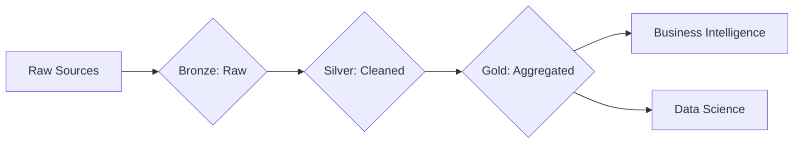

# The Architect’s Blueprint: From Data Warehouses to the Data Mesh

In the early days of computing, data was simple. You had a database, you ran a query,
and you got an answer. Today, data is a tidal wave. For a Data Engineer,
**architecture** isn't just about where you store bits and bytes; it’s about building a
reliable, scalable, and cost-effective highway system for information.

Whether you are just starting your journey or looking to refine a multi-petabyte
ecosystem, here is the definitive guide to data architecture.

---

## 1. The Foundation: The Data Warehouse (The Structured City)

For decades, the **Data Warehouse (DWH)** was the gold standard. It’s a highly
structured environment where data from various operational systems is **cleaned,
transformed, and loaded (ETL)**.

**Beginner View:** Think of it as a **library**. Every book has a specific place on a
specific shelf. You can find what you need quickly, but adding a new type of "book"
(like a video file) is impossible.

**Advanced View:** DWHs use **Schema-on-Write**. Data is structured before entering
the warehouse. They are optimized for **OLAP (Online Analytical Processing)** using
columnar storage, which makes analytical queries faster.

**Best for:** Standard business reporting and "One Version of the Truth."

> **Pro Tip for Beginners:** Start simple. Tools like **BigQuery**, **Snowflake**, or
> **Redshift** handle most DWH needs without complex setup.

---

## 2. The Expansion: The Data Lake (The Vast Reservoir)

As organizations collected **unstructured data**—social media posts, sensor logs,
images—the Warehouse became too rigid. Enter the **Data Lake**.

**Beginner View:** It’s a **giant bucket**. You throw everything in—raw, messy, or
clean—and organize it later.

**Advanced View:** This is **Schema-on-Read**. You store data in **low-cost object
storage** (like AWS S3, Azure Data Lake). The challenge is **Data Governance**; without
it, your lake becomes a **Data Swamp** where data is unusable.

**Best for:** Data Science, Machine Learning, and high-volume raw storage.

> **Pro Tip:** Always define a minimal structure or metadata to avoid turning your lake
> into a swamp. Even a simple CSV header or JSON schema helps a lot.

---

## 3. The Modern Standard: The Data Lakehouse

Why choose between a Warehouse and a Lake when you can have both? The **Lakehouse**
architecture implements a **"Medallion" structure** (Bronze, Silver, Gold) to bring
reliability to the lake.

> **Pro Tip:** Use technologies like Delta Lake or Apache Iceberg. They add a metadata
> layer for ACID transactions (Atomicity, Consistency, Isolation, Durability) on top of
> raw files. This ensures your data won’t break during updates.

> **Beginner Note:** Think of it like adding a library catalog to your giant bucket. You
> can still throw in raw files, but now you know exactly what’s inside and where to
> find it.

---

## 4. The Speed Demons: Lambda and Kappa

Sometimes, "yesterday's data" isn't enough. For fraud detection or stock trading, you
need sub‑second latency.

### Lambda Architecture

Runs two pipelines in parallel:

- **Batch Layer** → for accuracy
- **Speed Layer** → for real‑time insights

*Headache:* Maintaining two codebases for the same logic.

### Kappa Architecture

Everything is treated as a stream.

Tools like Apache Kafka or Pulsar process everything in real time.

> **Pro Tip:** To reprocess old data, point your stream processor to the start of the
> log and replay history.

> **Beginner Note:** Lambda is more complex but safer for large historical datasets.
> Kappa is simpler if everything is streaming anyway.

---

## 5. The Future: Data Mesh (Decentralization)

For massive enterprises, the central data team often becomes a bottleneck. Data Mesh
treats data as a Product, not a byproduct.

**Principles:**

- **Domain Ownership:** Teams like Marketing own their Data Product. They know it best,
  so they manage its quality.
- **Federated Governance:** Central team provides self‑serve tools, but departments
  maintain their own SLA (Service Level Agreement).

> **Beginner Note:** Think of it like each team running its own mini‑warehouse but using
> the same cloud platform. The central team ensures standards, but you own your data.

---

## Which Architecture Should You Choose?

- **Small Startup:** Start with a Data Warehouse (BigQuery, Snowflake). Keep it simple.
- **Heavy ML/AI Needs:** Build a Data Lakehouse (Databricks or S3 + Athena).
- **High‑frequency Real‑time:** Go Kappa with Kafka.
- **Global Enterprise (100+ teams):** Start migrating toward a Data Mesh.

**Reflection:** What stage is your data stack currently in? If you are stuck on a
migration, it’s useful to map out ETL/ELT logic before jumping to the next
architecture.

---

By understanding the journey from structured warehouses to decentralized data mesh, you
can build a scalable, reliable, and future-proof data ecosystem.

