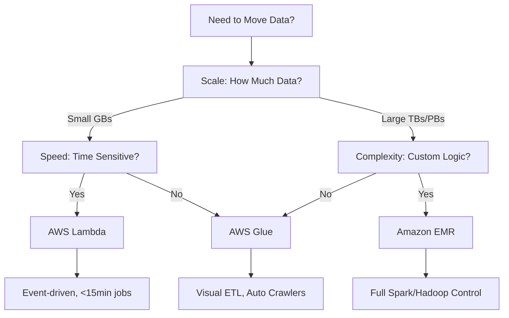
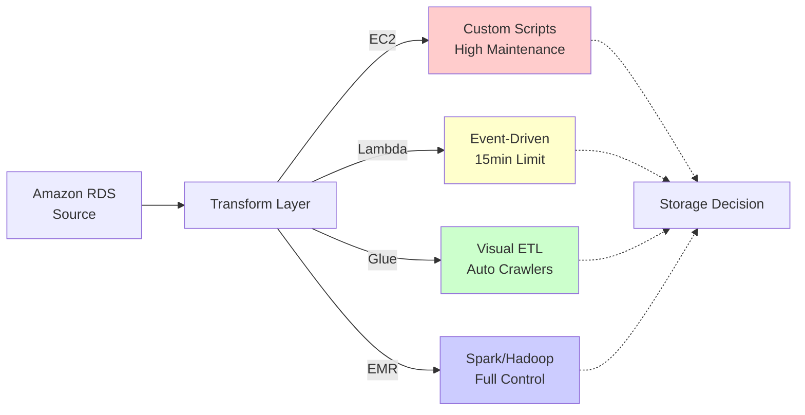
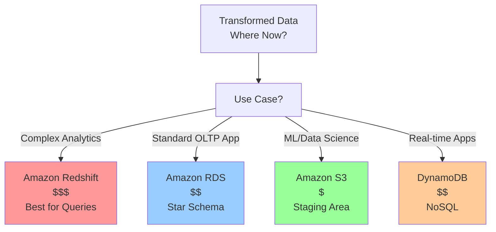

 
In data engineering, the transition from gathering requirements to selecting a tech stack is where the "magic" (and the danger) happens. It's easy to get distracted by the latest high-performance tools, but as the author Joe Reis often illustrates, **choosing a data tool without context is like choosing a vehicle without knowing your destination**.

## The Vehicle Analogy: Context is Everything

Imagine you need to transport your data team. You have two options:

- **A Jumbo Jet**: $225 million, 250+ passengers, 10,000-mile range.
- **A Tesla Model S**: $70,000, 4 passengers, 360-kilometer range.

Which is better? If you're going from New York to Paris, the Tesla is useless. If you're driving four people from New York to Boston, the jet is a massive waste of resources.

In AWS, the "Jumbo Jet" might be a massive EMR cluster, while the "Tesla" might be a simple Lambda function. **The "best" choice depends entirely on your team size, budget, and destination**.

## Navigating the AWS Batch Ecosystem

When building a batch ETL (Extract, Transform, Load) pipeline, you generally start with a source—often a relational database like Amazon RDS. The real architectural decisions begin once the data leaves that source.

### 1. The "Custom Build" Path: Amazon EC2

You could spin up a virtual server (EC2) and write custom Python or Bash scripts.

**The Downside**: This involves "undifferentiated heavy lifting." You are responsible for patching the OS, managing security, and scaling the hardware. In a modern cloud environment, this is rarely the best use of a data engineer's time.

### 2. The Serverless Path: AWS Lambda

Lambda is great for event-driven tasks.

**The Limitation**: It has a strict 15-minute timeout and limited memory/CPU. If your batch job is large or complex, you'll spend more time "chunking" your data to fit Lambda's constraints than actually transforming it.

### 3. The Purpose-Built Tools: Glue vs. EMR

For most big data batch workloads, the choice comes down to **Control vs. Convenience**.

| Feature | Amazon Glue ETL | Amazon EMR Serverless |
|---------|-----------------|----------------------|
| **Primary Goal** | Convenience & Integration | Control & Customization |
| **Key Strength** | Automated Crawlers & Data Catalog | Supports Spark, Hive, & Hadoop |
| **Best For** | Fast setup, visual design, and metadata management | Petabyte-scale analytics and custom frameworks |

**AWS Glue** stands out for its "Visual ETL" and Crawlers, which automatically discover your schema and populate a Data Catalog. This metadata makes it much easier for downstream services to understand your data.

## The Final Destination: Storage and Serving

Once your data is transformed, where does it go? This depends on who is using it:

- **For Analytics**: If you need complex queries on massive datasets, **Amazon Redshift** is the powerhouse choice, though it comes at a higher price point.

- **For General Apps**: A simple **RDS** instance might suffice if you are just modeling data in a star schema for a standard application.

- **For Machine Learning & Data Science**: This is where **Amazon S3** shines. It is the "staging area" of the cloud. It's cheap, virtually infinite in scale, and allows data scientists to grab raw or semi-processed objects (like Parquet or CSV files) to train their models.

## Conclusion

Don't build a jumbo jet to cross the street. **Start with serverless options first** to minimize maintenance, and only move toward more complex "heavy-duty" tools like EMR or Redshift when your scale and requirements demand it.

The key to successful data architecture is understanding your context, not blindly following trends.

