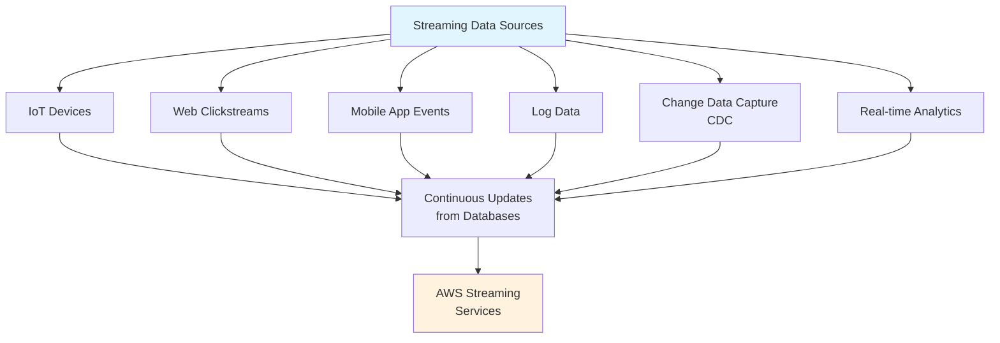
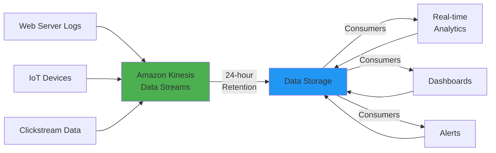
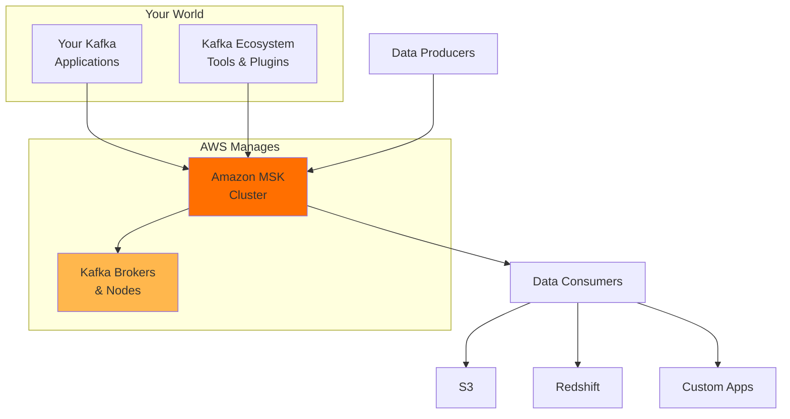
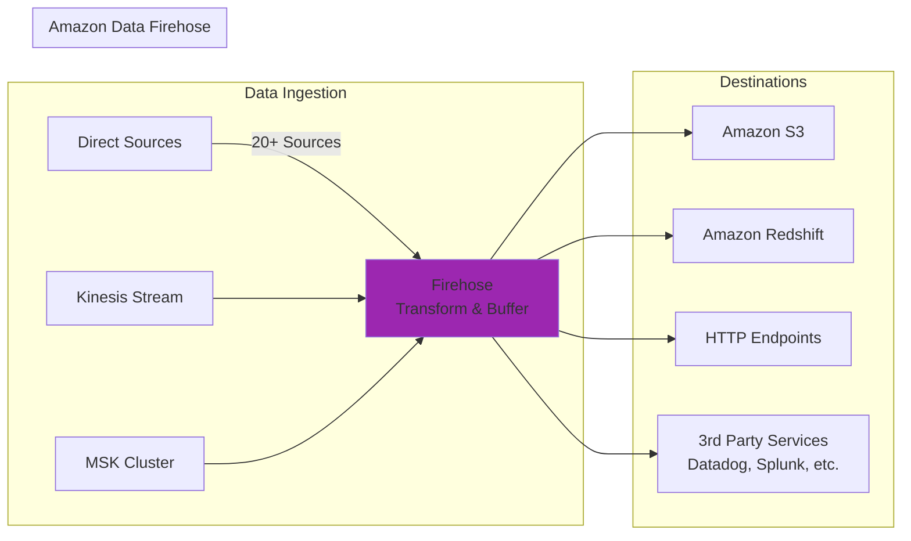
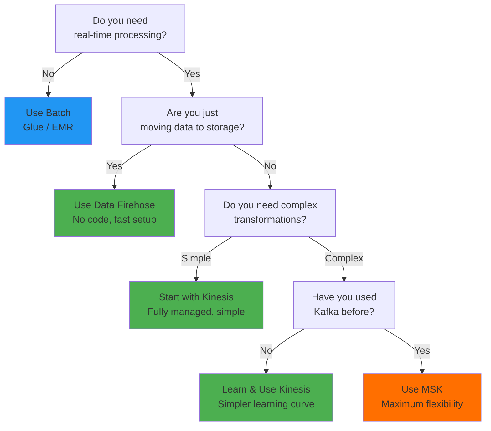
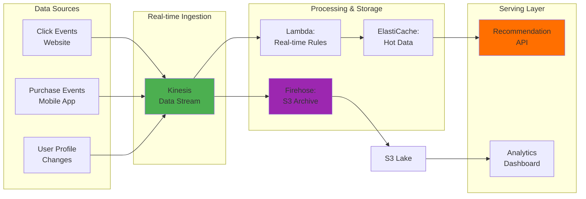

You've built batch pipelines. You've optimized your ETL workflows. But then reality hits: **data doesn't wait**. Your customers want real-time recommendations. Your infrastructure team needs live metrics. Your sensors are producing data *right now*. 

Welcome to the world of streaming data. Unlike batch processing where data arrives in neat, scheduled chunks, streaming data flows continuously from sources like IoT devices, clickstreams, or database change events. The challenge isn't just *how* to process it—it's *what tool* should you choose?

Just like with batch pipelines, AWS gives you multiple options. And just like before, **the right choice depends entirely on your use case, team expertise, and operational requirements**.

## Where Does Streaming Data Come From?

Before we explore AWS services, let's understand the sources. Streaming data can originate from:

The common thread? **Continuous, unbounded data streams** that need to be ingested, potentially transformed, and stored or analyzed in real-time.

## The DIY Path: Don't Do This (Usually)

You could spin up an EC2 instance, write custom Python scripts, handle CDC on your own, and pipe data downstream. You'd be responsible for:

- Installing and maintaining software
- Managing security patches and updates
- Scaling the infrastructure as data volume grows
- Monitoring and alerting when things fail at 3 AM

**This is undifferentiated heavy lifting.** Unless your use case is so specialized that no managed service can handle it, you probably shouldn't go this route.

The same applies to Lambda functions for streaming workloads. While Lambda can *technically* process streaming events, **streaming interactions are more complex than batch workloads**, and Lambda's limitations often make custom solutions problematic.

**The rule: Don't build your own streaming infrastructure unless you're 100% certain that existing AWS managed services cannot solve your problem.**

## Introducing: Kinesis Data Streams

**Amazon Kinesis Data Streams** is the workhorse of real-time data ingestion on AWS. Here's how it works:

**Data Producers** send data to a stream—JSON, XML, structured, unstructured, Kinesis doesn't care. It's **data agnostic**.

**Data Storage**: Kinesis holds this data for a configurable retention period:
- Minimum: 24 hours (default)
- Maximum: Extended retention up to 365 days (if needed)

**Data Consumers**: Multiple consumers can pull the same data and process it independently. This is powerful—multiple teams can derive different insights from the same stream simultaneously.

**Consumer Use Cases:**
- Archive data to S3 for later analysis
- Perform real-time analytics and generate alerts
- Feed data to data warehouses
- Drive real-time dashboards

Kinesis can handle **petabyte-scale data volumes** from multiple sources with **millisecond latency**. That's enterprise-grade streaming.

## The Kafka Alternative: Amazon MSK

What if your team already runs Apache Kafka? Or what if you need the flexibility and control that Kafka provides?

**Amazon Managed Streaming for Apache Kafka (MSK)** is a fully managed service that brings the power of open-source Kafka to AWS without the operational burden.

**Key Differences:**

| Aspect | Kinesis Data Streams | Amazon MSK |
|--------|------------------|-----------|
| **Base Technology** | AWS-native service | Open-source Apache Kafka |
| **Learning Curve** | Simpler, AWS-designed | Steeper if new to Kafka |
| **Flexibility** | Good for standard use cases | Expert-level control |
| **Ecosystem** | AWS-only integrations | 100+ Kafka plugins supported |
| **Operational Overhead** | Lower (fully managed) | MSK handles infrastructure, you manage apps |
| **Best For** | New to streaming, want simple setup | Kafka expertise in-house, need flexibility |

**Why MSK?**

- You already have Kafka expertise on your team
- You're running Kafka elsewhere and want consistency
- You need to leverage existing Kafka plugins or tooling
- Your use case requires the level of control Kafka provides

**Why Kinesis?**

- You're brand new to streaming architectures
- You want AWS to handle all the infrastructure complexity
- Your needs fit Kinesis's feature set
- You prefer operational simplicity

## The Missing Piece: Data Firehose

Here's a problem AWS spotted early on:

> Many Kinesis users were just doing one thing: **read from stream → chunk data → store in S3 or Redshift**. Why make them write code for this?

Thus, **Amazon Data Firehose** was born.

**Data Firehose is the "simple mode" for getting streaming data into storage.** You don't write custom code. You just configure:

1. **Source**: Where is the data coming from? (Kinesis, direct sources, MSK, etc.)
2. **Transformation**: Do you want to transform records? (Optional Lambda functions)
3. **Destination**: Where should it go? (S3, Redshift, HTTP, third-party services)
4. **Buffering**: How much data should it buffer before writing? (Size-based or time-based)

Firehose handles the chunking, buffering, retries, and delivery automatically. **No custom code needed.**

## Choosing Your Streaming Architecture

## Real-World Architecture: Product Recommendation Engine

Let's tie this together. Imagine you're building a real-time recommendation system:

**Architecture Flow:**

1. **Sources** produce events (clicks, purchases, profile updates)
2. **Kinesis Stream** ingests all events in real-time
3. **Firehose** archives raw events to S3 (for historical analysis)
4. **Lambda Consumers** process events in real-time (update cache, trigger alerts)
5. **ElastiCache** holds hot data for fast API responses
6. **Recommendation API** serves predictions with <100ms latency
7. **S3 Lake** feeds analytics and model training

This architecture scales to millions of events per second while maintaining millisecond latency.

## Key Takeaways

| Service | When to Use |
|---------|------------|
| **Kinesis Data Streams** | Real-time processing with custom logic, multiple consumers, pet-scale data |
| **Amazon MSK** | Already use Kafka, need fine-grained control, have Kafka expertise |
| **Data Firehose** | Simply moving streaming data to storage, want minimal code, fast deployment |
| **EC2/Lambda DIY** | Only if AWS services + Firehose genuinely cannot solve your problem (rare) |

## The Mindset

Streaming is just batch's faster cousin. The same architectural principles apply:

- **Separate concerns:** Source → Transform → Destination
- **Choose tools for your use case:** Not all problems need petabyte-scale streaming
- **Avoid undifferentiated heavy lifting:** Use managed services
- **Start simple:** Firehose for storage, Kinesis for logic, MSK only if necessary

Your job as a data engineer isn't to build the fanciest streaming pipeline. It's to build the **simplest pipeline that solves your problem reliably, at the scale you need, with the operational overhead your team can handle**.

Now go build something real-time.

