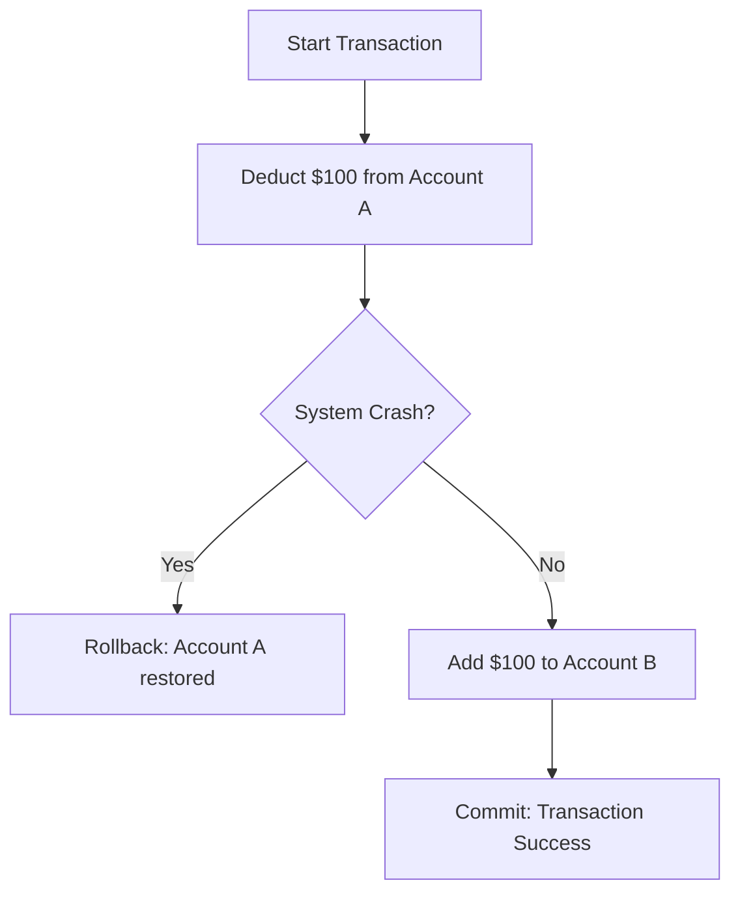
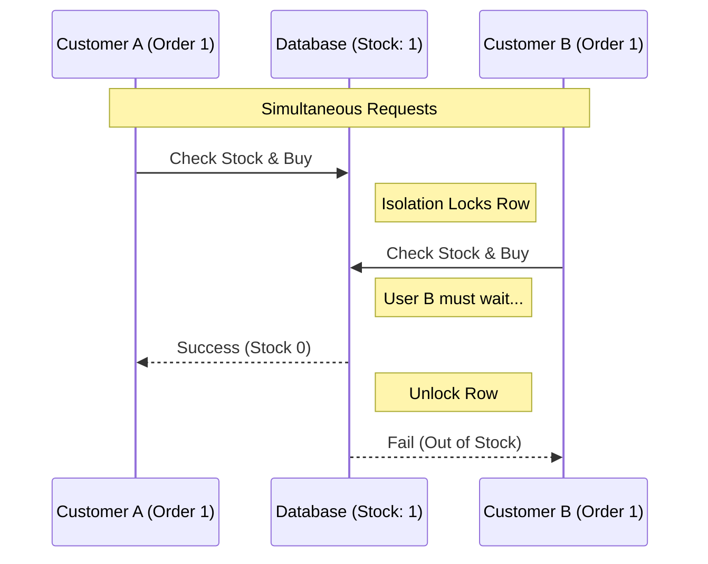

<br>
In the world of **Online Transaction Processing (OLTP)**, speed is a given. Whether you are handling bank transfers or flash sales, databases must process thousands of changes per second. But speed without reliability is a recipe for disaster.

Imagine transferring money between accounts just as your Wi-Fi cuts out. You’d hope the money either stays in the original account or arrives at the destination—but it should never simply "disappear." This is where **ACID compliance** comes in.

---

## What is ACID?
ACID is an acronym representing four key principles that ensure database transactions are processed reliably. While most relational databases (SQL) are ACID compliant by default, many NoSQL databases allow you to configure these settings based on your needs.

### 1. Atomicity: "All or Nothing"
Atomicity treats a transaction as a single, indivisible unit. If one part of the transaction fails, the whole thing is rolled back.



### 2. Consistency: "Follow the Rules"
Consistency ensures that any data written follows the predefined rules of the database schema, moving the database from one valid state to another.

### 3. Isolation: "Wait Your Turn"
Isolation ensures that concurrent transactions don't interfere with each other. Even if two orders hit the database at the exact same time, they are processed as if they were in a queue.



### 4. Durability: "Built to Last"
Durability guarantees that once a transaction is committed, it’s permanent. Even if the server loses power a second later, the data is safely written to disk.

## SQL vs. NoSQL: How They Compare

| Principle | Relational (SQL) | Non-Relational (NoSQL) |
|---|---|---|
| Atomicity | Default. All-or-nothing across all tables. | Scoped. Usually atomic only for a single document. |
| Consistency | Strong. Enforced by strict schemas. | Flexible. Often "Eventual" by default. |
| Isolation | High. Uses locking to prevent overlap. | Variable. May allow "stale" reads for speed. |
| Durability | Absolute. Flushed to disk immediately. | Configurable. Some write to RAM first. |

## The "Overloaded" Term: Understanding Consistency
As a data engineer, you will hear "Consistency" used in two different ways. It is important not to confuse them:

- **C in ACID**: Refers to Data Integrity (rules like "no negative balances").
- **Strong Consistency**: Refers to Distributed Systems (all servers show the same data at once).

## Eventual Consistency vs. Strong Consistency
In distributed NoSQL systems, you often trade immediate consistency for speed.

```mermaid
graph LR
    User((User)) -- Updates Profile --> S1[(Server A)]
    S1 -- Syncing... --> S2[(Server B)]
    S1 -- Syncing... --> S3[(Server C)]

    Friend1((Friend NY)) -- Reads from --> S1
    Friend2((Friend UK)) -- Reads from --> S3

    style Friend1 fill:#ccffcc
    style Friend2 fill:#ffcccc
    Note over Friend1: Sees update instantly
    Note over Friend2: Sees old data for 1-2 seconds
```

## Why This Matters for Data Engineers
Understanding when your database needs to be ACID compliant can help you prevent disasters. Relational databases are the "gold standard" for accuracy, but relaxing these constraints in NoSQL can make your application significantly more scalable.
