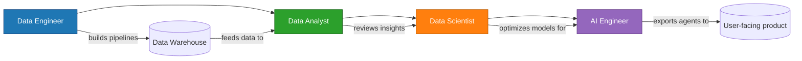
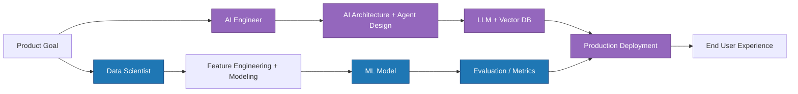
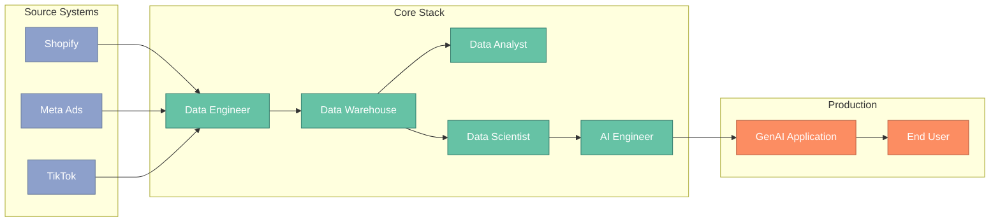
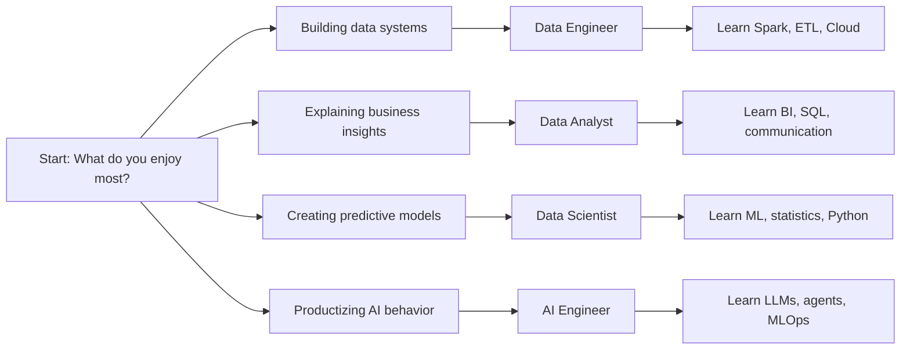

## Introduction

This is a simple career guide for data analyst, data engineer, data scientist, and AI engineer roles in 2026.

- Clear role differences.
- Practical skills to learn.
- A friendly decision path.

## Data Pyramid (Modern)

## 1. Data Engineer: foundation of the stack

### What they do (easy)
- Get data from apps and services into one place.
- Clean data so it is accurate.
- Keep data pipelines running every day.
- Make sure data is ready for others.

### Main skills
- SQL and Python
- Cloud storage and databases
- Basic automation and simple monitoring

## 2. Data Analyst: clear business answers

### What they do
- Look at data to find what happened.
- Make charts and reports.
- Find problems, like low mobile checkout rate.
- Talk to leaders with simple stories.

### Main skills
- SQL and dashboards
- Communication
- Basic business math

## 3. Data Scientist vs AI Engineer: top of pyramid

### Difference in 2026
- Data Scientist: prediction, statistical modeling, hypothesis testing
- AI Engineer: orchestrate LLMs, vector search, prompt engineering, agentic workflows

### Real-world integration
- Data scientist supports backlog by generating high-confidence models
- AI engineer productizes models into APIs/agents
- Together they create a deployed feedback loop for continuous improvement

## 4. Career verdict (practical path)

| Starting Point | Good First Job | 1-2yr upskill | Why it works |
|---|---|---|---|
| Non-technical | Data Analyst | Data Engineer / Data Scientist | Fast entry + domain exposure |
| Strong coding | Data Engineer | AI Engineer | Build systems + chain into intelligent
| Research + stats | Data Scientist | AI Engineer | add deployment and engineering skills |

### Danger alert
- Pure dashboard-only analyst roles are highly automatable by GenAI.
- You should own upstream data framing and strategy, not just report display.

## 5. Modern toolkit (high-level)

## 5.5 Role decision quick map

## 6. Practical checklist

- [ ] Identify foundational role based on strengths (analyst vs engineer vs scientist)
- [ ] Learn SQL + Python first; then layer specialized tools
- [ ] Ensure each step is connected to business outcomes
- [ ] Practice end-to-end scenario (source > warehouse > insights > action)
- [ ] Keep learning AI + automation to stay future-proof

## 7. Closing recommendation

In 2026, the safest choice is not comfort—it's adaptability.
Start where you can win quickly, then expand into adjacent high-growth roles: data engineering, data science, and finally AI engineering.

---

*Want a deeper course-style path? I can add a dedicated post on the analytics engineer role and step-by-step learning track.*
