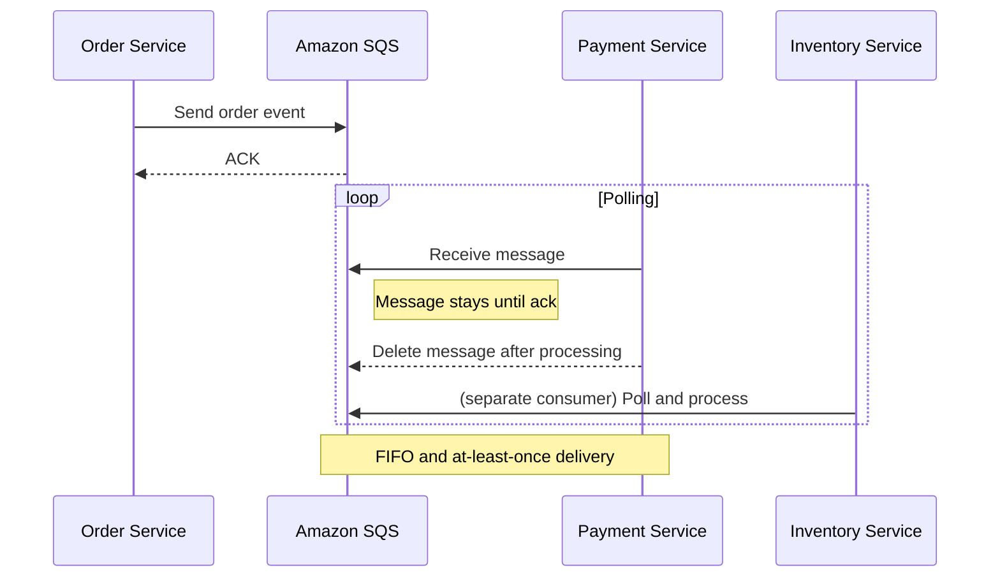
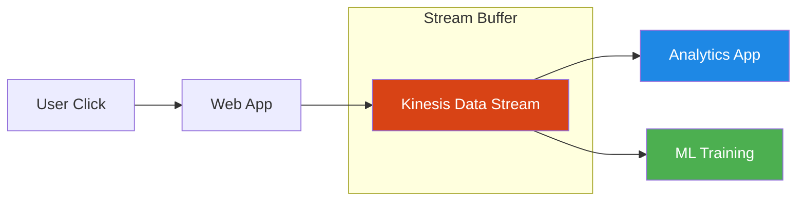
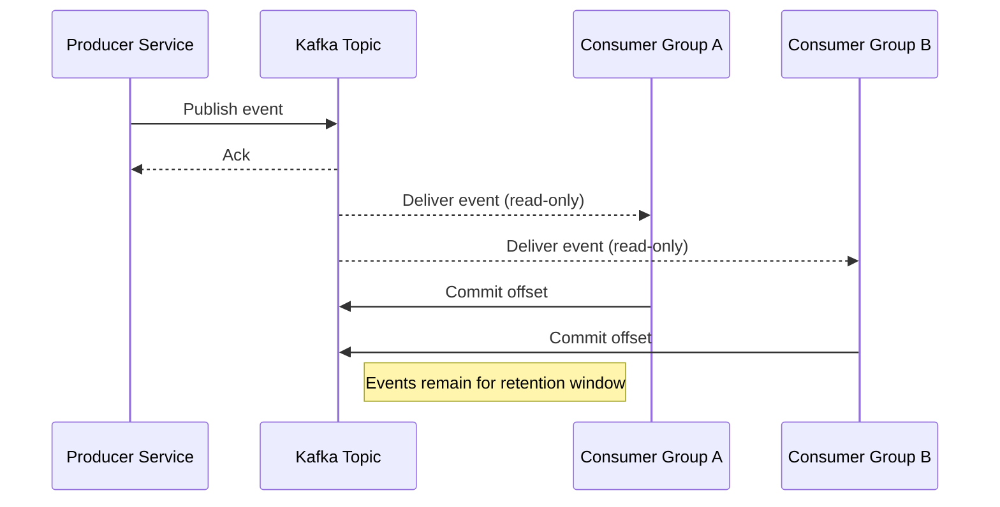
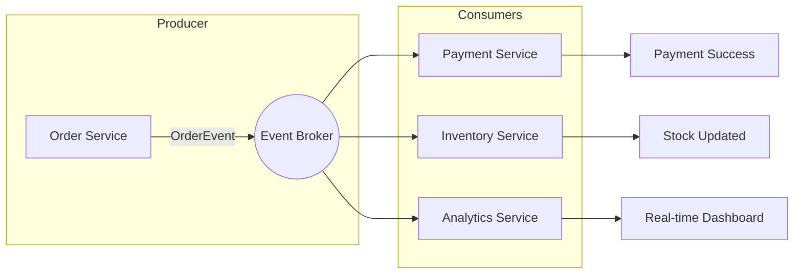

In previous courses, we explored the difference between batch and stream processing across multiple stages of the data engineering lifecycle. In the final lab of the previous module, you worked on a hybrid architecture where batch and streaming collaborate in a recommendation system.

This article focuses on event-driven architectures and the role of message queues and streaming platforms as source systems in data pipelines.

Now we’ll zoom into event-driven architectures and how message queues and streaming platforms operate as source systems for your pipelines.

## Core Terms: Events, Messages, Streams

- **Event**: A change in state or something that happened (user click, sensor reading, etc.).
- **Message**: A record containing information about an event, often with metadata and a timestamp.
- **Stream**: A sequence of messages over time (click logs, telemetry data, etc.).

In practice, "event" and "message" are often used interchangeably. For data engineering, they are functionally equivalent in source systems.

## Batch vs Stream Processing on Event Streams

- **Batch**: Process chunks of message data over a time window.
- **Streaming**: Process each message immediately as it arrives.

Essentially, all data is event-based at the source. Batch and streaming differ in how we group and consume these events.

## Key Components of a Streaming System

1. **Event Producer**: Emits events (IoT device, website, API).
2. **Event Router / Broker**: Routes events from producers to consumers (Kafka, Kinesis, SQS).
3. **Event Consumer**: Processes events (payment service, inventory update, analytics microservice).

A strong architecture decouples producers and consumers, enabling asynchronous processing and fault tolerance.

## Message Queues vs Streaming Platforms

### Message Queue (e.g., Amazon SQS)

- Router acts as FIFO queue.
- Consumer reads message, acknowledges, message is removed.
- Suitable when exactly-once delivery and simple consumer scaling are required.
- Example use case: Microservices task processing, serverless event workflows.

### Streaming Platform (e.g., Kafka, Kinesis Data Streams)

- Router appends events to an immutable log.
- Consumers read sequentially; messages are not deleted automatically.
- Supports reprocessing/replay from historical offsets.
- Enables event-sourcing, time travel analytics, and durable event retention.

## Events, Producers, Brokers, and Consumers in Action

In an e-commerce example:

- Order placement event is generated by the ordering system (producer).
- Payment service consumes the event and processes payment.
- Inventory service consumes the event and updates stock.
- Broker ensures events are reliably delivered to both services.

This pattern is common in modern data platforms and supports extensible pipelines.

## Amazon SQS Message Queue (Mermaid)

## Amazon Kinesis Streaming Platform (Mermaid)

## Amazon Kafka-style Pub/Sub (Mermaid)

## Beginner and Reference Notes (Key Concepts)

### Core Definitions

- **Event**: A state change or external occurrence (e.g., click, sensor value change, transaction event).
- **Message**: Structured payload that carries event details plus metadata (ID, timestamp, type).
- **Stream**: Ordered, potentially infinite sequence of messages.
- **Producer**: Source component that emits events (app, device, API).
- **Broker**: Messaging infrastructure that stores/routs messages (SQS, Kafka, Kinesis).
- **Consumer**: Processor that reads events and produces action/outcomes.

### Key Trade-offs

- **Message queue**: point-to-point, each event consumed once and removed; ideal for worker queues and linear workflows.
- **Stream log**: append-only, multiple consumers can replay events; ideal for analytics, event sourcing, and durable audit trails.
- **Batch**: periodic read of accumulated events.
- **Stream processing**: continuous event-by-event handling.

### Quick foundation checklist

- [ ] Event data must be immutable and idempotent-friendly.
- [ ] Assign durable IDs and timestamps to events.
- [ ] Use message queues for task processing and job orchestration.
- [ ] Use streaming platforms for replay and multi-consumer distribution.
- [ ] Implement the right delivery semantics (at-least-once, at-most-once, exactly-once).

## Design Guidance for Data Engineers

- Treat upstream systems as producers of events.
- Separate ingestion, processing, and serving via decoupled components.
- Choose queue vs log based on delivery and replay needs.
- Provide clear failure handling paths and dead-letter support for queue messages.
- Implement consumer checkpointing when using streaming logs.

## Architectures in Practice

### Event-driven shopping flow (business example)

1. User places order => event emitted by order service.
2. Broker receives event (SQS/Kinesis/Kafka).
3. Payment system and inventory system consume event independently.
4. Analytics system also consumes same event for KPI updates.

### Illustrated process

## How to choose between queue and stream

| Requirement | Use Queue (SQS) | Use Stream (Kafka/Kinesis) |
|---|---|---|
| Single consumer processing | ✅ | ⚪ |
| Multiple independent consumers | ⚪ | ✅ |
| Event replay | ⚪ | ✅ |
| Stateful stream processing | ⚪ | ✅ |
| Exactly-once (with effort) | ⚪ | ✅ (Kafka + transactions) |

## Complete event architecture reference

- SQS: simple queue, at-least-once, dead-letter queue support
- Kinesis: ordered shard stream, retention window, replay
- Kafka: distributed commit log, configurable retention and consumer offsets

## Professional Checklist

- [ ] Define event schema and versioning strategy.
- [ ] Standardize event metadata (source ID, createdAt, eventType).
- [ ] Implement schema validation before broker publish.
- [ ] Build consumer retries and deduplication.
- [ ] Monitor latency, processing throughput, and lags.
- [ ] Document SLA for each stream/quue in architecture docs.
