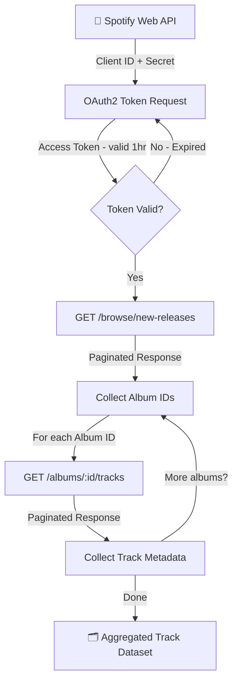
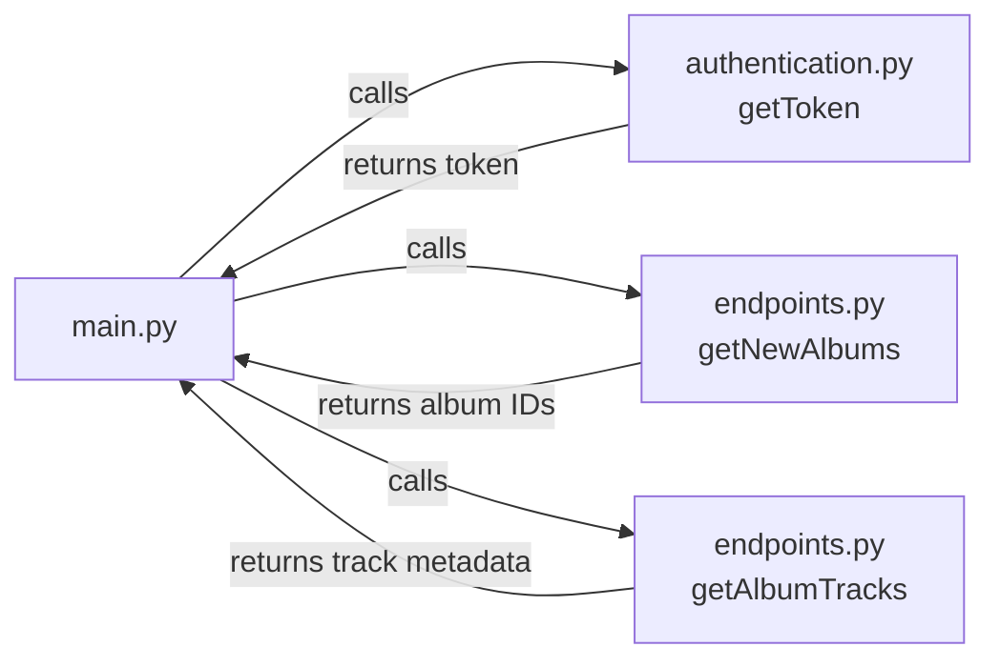
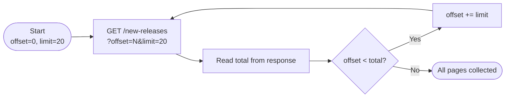
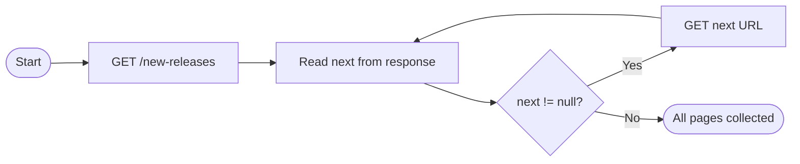
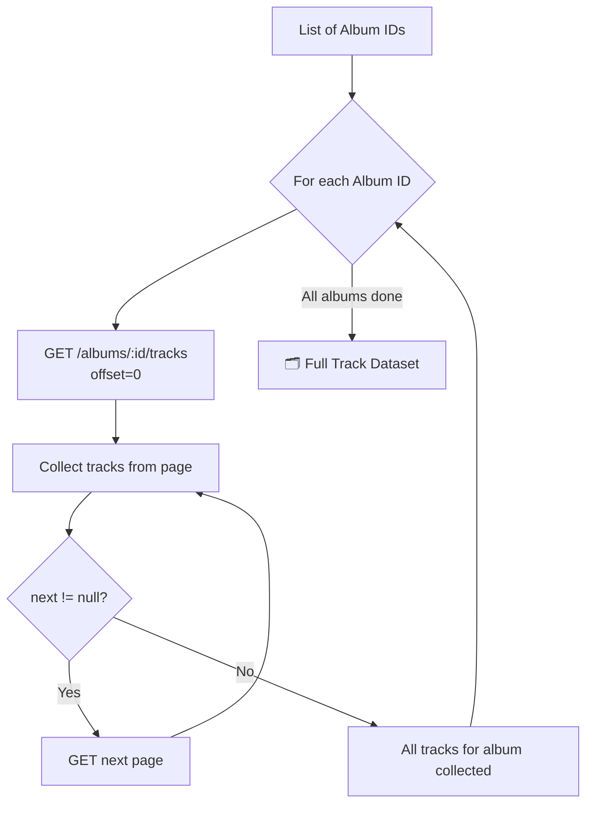
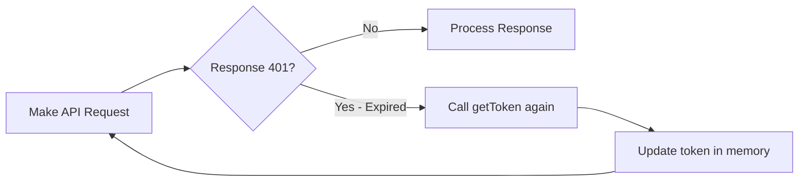

# Spotify API Data Ingestion Pipeline

In this project, you will build a batch data ingestion pipeline using the Spotify Web API. You will authenticate with the API using OAuth2, retrieve paginated music catalog data, and implement a pipeline that extracts album and track metadata. This project simulates a real-world data engineering workflow — signing up for a third-party platform, obtaining credentials, reading API documentation, and writing production-style Python code to extract data at scale.

Table of Contents
-----------------
- [Introduction](#1)
- [Setup & Authentication](#2)
- [Architecture](#3)
- [Retrieving New Releases](#4)
- [Implementing Pagination](#5)
  - [Manual Offset Approach](#5-1)
  - [Next URL Approach](#5-2)
- [Batch Track Ingestion](#6)
- [Token Management](#7)

---

<div id='1'/>

## 1 - Introduction

As a data engineer, you will frequently need to extract data from third-party REST APIs. Most APIs require authentication, follow structured patterns for accessing resources, and return data in paginated chunks rather than all at once. This project walks through all of these patterns using the Spotify Web API as a live data source.

The Spotify Web API is a RESTful API that gives you access to Spotify's music catalog — including albums, artists, and tracks. Every request to the API requires an access token, which is obtained through an OAuth2 authorization flow using your account credentials.

Below is the overall pipeline architecture:



---

<div id='2'/>

## 2 - Setup & Authentication

Before making any API calls, you need a Spotify developer account to obtain the credentials used to generate access tokens.

**2.1.** Sign up or log in at [spotify.com](https://www.spotify.com). Navigate to your account **Dashboard** and click on **Create App**.

**2.2.** Fill in the following details:
- **App Name**: `Spotify API Pipeline`
- **App Description**: `Spotify App to test the API`
- **Redirect URI**: `http://localhost:8080`
- **API type**: Web API

Click **Save**.

**2.3.** Open the app and go to **Settings** to find your **Client ID** and **Client Secret**. Copy both values.

**2.4.** Paste your credentials into `src/.env`:

```env
CLIENT_ID=your_client_id_here
CLIENT_SECRET=your_client_secret_here
```

**2.5.** Install dependencies:

```bash
pip install requests python-dotenv
```

**2.6.** Load your credentials and generate an access token using the provided `getToken()` function:

```python
import os
from dotenv import load_dotenv

load_dotenv()
client_id = os.getenv("CLIENT_ID")
client_secret = os.getenv("CLIENT_SECRET")

token_response = getToken(client_id, client_secret)
# Returns: { "accessToken": "...", "token_type": "Bearer", "expiresIn": 3600 }
```

> **Note:** The access token expires after **1 hour**. The pipeline includes logic to automatically detect expiration and request a new token — covered in [Section 7](#7).

---

<div id='3'/>

## 3 - Architecture

The project is organized as follows:

```
spotify-api-pipeline/
│
├── src/
│   ├── .env                  # Stores CLIENT_ID and CLIENT_SECRET
│   ├── authentication.py     # getToken() — OAuth2 client credentials flow
│   ├── endpoints.py          # Paginated API call functions
│   └── main.py               # Orchestrates the full ingestion pipeline
│
└── notebooks/
    └── exploration.ipynb     # Jupyter Notebook for development and testing
```

The three source modules work together as shown:



---

<div id='4'/>

## 4 - Retrieving New Releases

The first API call fetches the latest album releases from Spotify's catalog using the `GET /browse/new-releases` endpoint. The `getAuthHeader()` helper function formats the access token into the required authorization header.

```python
import requests

endpoint = "https://api.spotify.com/v1/browse/new-releases"
headers = getAuthHeader(token_response.get("accessToken"))

response = requests.get(endpoint, headers=headers)
data = response.json()
```

A successful response returns a JSON object structured as follows:

```json
{
  "albums": {
    "href": "https://api.spotify.com/v1/browse/new-releases?offset=0&limit=20",
    "items": [ "..." ],
    "limit": 20,
    "offset": 0,
    "total": 100,
    "next": "https://api.spotify.com/v1/browse/new-releases?offset=20&limit=20"
  }
}
```

Key fields to note:
- **`items`** — the album records for this page
- **`total`** — total number of albums available (e.g. 100)
- **`offset`** / **`limit`** — current page position
- **`next`** — pre-built URL to fetch the next page

Because the API returns a maximum of 20 items per request by default, you need to **paginate** to collect all 100 albums — covered in the next section.

---

<div id='5'/>

## 5 - Implementing Pagination

Instead of retrieving all records in one request, the API returns data in pages. Two pagination strategies are implemented and compared.

<div id='5-1'/>

### 5.1 - Manual Offset Approach

Manually increment the `offset` parameter by the `limit` after each request until `offset` reaches the `total`.



```python
offset = 0
limit = 20
total = None
all_albums = []

while total is None or offset < total:
    response = getNewAlbums(offset=offset, limit=limit)
    total = response["albums"]["total"]
    all_albums.extend(response["albums"]["items"])
    offset += limit
```

<div id='5-2'/>

### 5.2 - Next URL Approach

Use the `next` field from each response to chain requests automatically — no manual offset tracking needed.



```python
response = getNewAlbums(offset=0, limit=20)
all_albums = response["albums"]["items"]
next_url = response["albums"]["next"]

while next_url:
    response = getNewAlbums(full_endpoint=next_url)
    all_albums.extend(response["albums"]["items"])
    next_url = response["albums"]["next"]
```

---

<div id='6'/>

## 6 - Batch Track Ingestion

With a full list of album IDs collected, the second stage of the pipeline fetches the track listing for each album using `GET /albums/{id}/tracks`. This endpoint is also paginated, so the same strategies from Section 5 apply.



```python
# main.py

# Step 1: Paginated fetch of all new album IDs
album_ids = get_all_new_album_ids(token)

# Step 2: For each album, paginated fetch of all tracks
all_tracks = []
for album_id in album_ids:
    tracks = get_all_album_tracks(album_id, token)
    all_tracks.extend(tracks)
```

---

<div id='7'/>

## 7 - Token Management

The access token expires after 1 hour. The pipeline automatically detects expiration mid-run and requests a new token before continuing.



```python
import time

token_response = getToken(client_id, client_secret)
token_expiry = time.time() + token_response["expiresIn"]

def get_valid_token():
    global token_response, token_expiry
    if time.time() >= token_expiry:
        token_response = getToken(client_id, client_secret)
        token_expiry = time.time() + token_response["expiresIn"]
    return token_response.get("accessToken")
```

---

## API Endpoints Reference

| Endpoint | Method | Description |
|---|---|---|
| `https://accounts.spotify.com/api/token` | POST | Generate OAuth2 access token |
| `https://api.spotify.com/v1/browse/new-releases` | GET | Retrieve new album releases |
| `https://api.spotify.com/v1/albums/{id}/tracks` | GET | Retrieve tracks for a given album |

---

## Key Concepts Demonstrated

**REST API Interaction** — Sending authenticated HTTP GET requests and parsing JSON responses with Python's `requests` library.

**OAuth2 Authorization** — Implementing the client credentials flow, a standard pattern when integrating with third-party APIs as a data engineer.

**Pagination** — Handling APIs that cap results per request, using both manual offset and cursor-based `next` URL strategies.

**Batch Ingestion** — Orchestrating nested API calls: first collecting resource IDs, then extracting detailed records for each — a common ETL pattern.

**Token Lifecycle Management** — Detecting and recovering from token expiry mid-pipeline to ensure uninterrupted data extraction.

---

## Lessons Learned

- Always read API documentation before writing code — endpoint parameters, response shapes, and auth flows differ between providers
- Pagination is a standard API pattern; understanding both offset and cursor strategies is essential for data engineering
- Credentials should always be stored in environment variables, never hardcoded
- Token expiry must be handled gracefully in any long-running ingestion job

---

## Future Improvements

- [ ] Persist extracted track data to SQLite or CSV
- [ ] Add retry logic with exponential backoff for failed requests
- [ ] Extend pipeline to extract artist and audio feature metadata
- [ ] Schedule pipeline runs with Apache Airflow or cron

---

## Resources

- [Spotify Web API Documentation](https://developer.spotify.com/documentation/web-api)
- [Spotify Authorization Guide](https://developer.spotify.com/documentation/general/guides/authorization/)
- [Python `requests` Library](https://requests.readthedocs.io/en/latest/)
