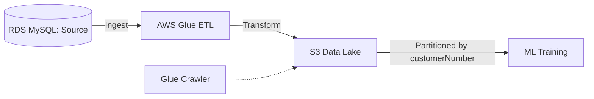
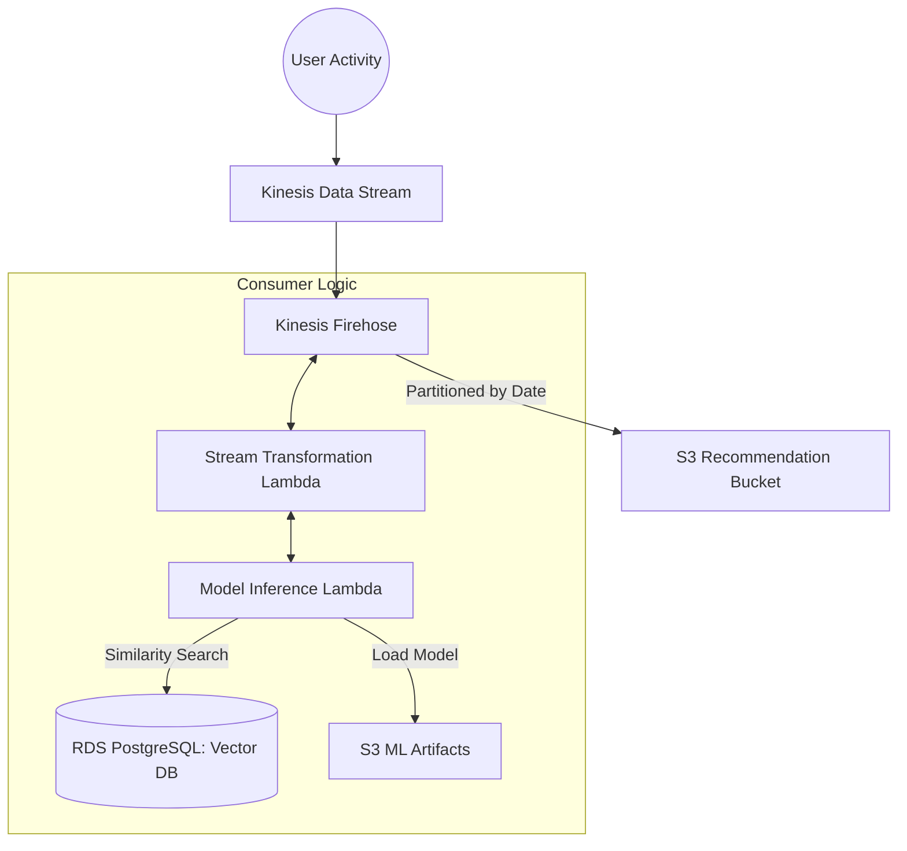

This technical guide outlines the end-to-end implementation of batch and streaming data pipelines for a real-time recommender system, following the "Thinking like a Data Engineer" framework.

---

## Phase 1: Batch Pipeline Implementation
The batch pipeline extracts historical data to serve as the training set for the recommendation model.

### Technical Steps:
1.  **Source Data Exploration:** Connect to the **Amazon RDS MySQL** database (`classicmodels`) to explore the `ratings` table, which contains user scores (1-5) for various products.
2.  **Environment Configuration:** Run `scripts/setup.sh` to initialize environment variables required for infrastructure deployment.
3.  **Infrastructure as Code (IaC):** Use **Terraform** to provision the ETL resources. This involves uncommenting the `etl` module in `main.tf` and the corresponding outputs in `outputs.tf`, then running `terraform init` and `terraform apply`.
4.  **ETL Execution:** Trigger the **AWS Glue ETL** job (`de-c1w4-etl-job`). The job ingests raw data from RDS, transforms it into a training-ready format, and stores it in an **Amazon S3 Data Lake**.
5.  **Verification:** Confirm that data is partitioned by `customerNumber` in the S3 bucket (`de-c1w4-<ACCOUNT>-datalake`) under the `ratings-ml-training` folder.

### Batch Process Architecture

---

## Phase 2: Vector Database Setup
A specialized database is required to perform fast similarity searches for product recommendations.

### Technical Steps:
1.  **Resource Provisioning:** Deploy an **Amazon RDS PostgreSQL** instance with the **`pgvector`** extension using Terraform (module `vector_db`).
2.  **Credential Retrieval:** Use `terraform output` to securely retrieve the database host, master username, and password.
3.  **Data Preparation:** Update the `sql/embeddings.sql` file with the specific S3 bucket name (`de-c1w4-<ACCOUNT>-ml-artifacts`) containing the pre-trained embeddings.
4.  **Loading Embeddings:** Connect to the PostgreSQL instance and execute the SQL script to import `user_embeddings.csv` and `item_embeddings.csv` from S3 into the database.

---

## Phase 3: Real-Time Inference Configuration
This phase connects the trained model and the vector database to the inference engine.

### Technical Steps:
1.  **Lambda Configuration:** Locate the `de-c1w4-model-inference` **AWS Lambda** function in the console.
2.  **Environment Variables:** Update the function's configuration with the following variables retrieved from Terraform outputs:
    *   `VECTOR_DB_HOST`
    *   `VECTOR_DB_USER`
    *   `VECTOR_DB_PASSWORD`

---

## Phase 4: Streaming Pipeline Implementation
The streaming architecture processes live user activity to deliver instant recommendations.

### Technical Steps:
1.  **Deploy Streaming Infrastructure:** Use Terraform (module `streaming_inference`) to provision **Kinesis Data Streams**, **Kinesis Data Firehose**, and the **S3 Recommendation Bucket**.
2.  **Stream Transformation:** Kinesis Data Firehose is configured to invoke a **transformation Lambda** (`de-c1w4-transformation-lambda`). This function extracts user/product features and calls the model inference logic to find product matches.
3.  **Output & Monitoring:** Final recommendations are loaded into the S3 bucket, partitioned by date. Monitor system health and transformation logic via **Amazon CloudWatch Logs**.

### Streaming Process Architecture

---

## Data Schema (Post-ETL)
The batch pipeline results in a refined schema for machine learning training:

| Data Type | Field Name | Key Type |
| :--- | :--- | :--- |
| **int** | customerNumber | PK |
| **string** | city, state, postalCode, country | |
| **float** | creditLimit | |
| **string** | productCode | PK |
| **string** | productLine, productScale | |
| **int** | quantityInStock, buyPrice, MSRP | |
| **int** | **productRating (Target)** | |

---

## Summary of Tools & Technologies
*   **Infrastructure:** Terraform (IaC).
*   **Storage:** Amazon S3 (Data Lake, ML Artifacts, Recommendations).
*   **Processing:** AWS Glue (Batch) and AWS Lambda (Streaming).
*   **Streaming:** Amazon Kinesis Data Streams & Firehose.
*   **Databases:** RDS MySQL (Source) and RDS PostgreSQL with `pgvector` (Vector DB).
*   **Monitoring:** Amazon CloudWatch.

This is a comprehensive README file for your portfolio, structured to showcase the end-to-end data engineering project detailed in the sources.

***

# End-to-End Batch and Streaming Pipelines for Real-Time Recommendations

## Project Overview
This project demonstrates the implementation of a full-scale data engineering architecture designed to meet stakeholder requirements for a product recommender system. The solution encompasses a **batch pipeline** for processing historical training data and a **real-time streaming pipeline** for providing live product recommendations based on user activity.

## Key Features
*   **Thinking like a Data Engineer:** Translated high-level stakeholder needs into functional data architectures.
*   **Infrastructure as Code (IaC):** Utilized **Terraform** to configure, provision, and manage all AWS resources, ensuring reproducible and scalable deployments.
*   **Hybrid Data Processing:** Integrated both batch (AWS Glue) and streaming (AWS Kinesis) workflows to handle different data velocity requirements.
*   **Vector Search Capabilities:** Implemented a **Vector Database** using PostgreSQL and the `pgvector` extension to enable high-speed similarity searches for product embeddings.

## Technical Architecture

### 1. Batch Pipeline (Training Data Preparation)
The batch workflow ingests raw product and user data (including a `ratings` table) from an **Amazon RDS MySQL** database.
*   **ETL Process:** **AWS Glue ETL** transforms the raw data into formatted training datasets.
*   **Storage:** Transformed data is stored in an **Amazon S3 Data Lake**, partitioned by customer number for optimized downstream ML training.

### 2. Vector Database Setup
To support real-time inference, the project utilizes a specialized **Amazon RDS PostgreSQL** instance with the **`pgvector`** extension.
*   **Embedding Storage:** The database stores high-dimensional user and item embeddings generated by the ML model.
*   **Optimization:** This setup allows the recommender system to rapidly retrieve items similar to those a user is currently interacting with.

### 3. Streaming Pipeline (Real-Time Inference)
The streaming architecture provides live recommendations by processing online user logs.
*   **Ingestion:** **AWS Kinesis Data Streams** captures real-time user activity from the sales platform.
*   **Transformation & Inference:** An **AWS Lambda** function is triggered to extract features and query the Vector Database for similar product recommendations.
*   **Delivery:** **Kinesis Data Firehose** delivers the final recommendations into a dedicated S3 bucket, partitioned by date for historical analysis.

## Technologies Used
*   **Cloud Provider:** AWS (S3, Glue, RDS, Lambda, Kinesis Data Streams, Kinesis Firehose, CloudWatch).
*   **Infrastructure:** Terraform.
*   **Databases:** MySQL (Source), PostgreSQL with `pgvector` (Vector DB).
*   **Languages:** SQL, Bash (Environment Setup).

## Project Structure
*   `/terraform`: Contains `main.tf` and `outputs.tf` for infrastructure provisioning.
*   `/scripts`: Includes `setup.sh` for environment variable configuration.
*   `/sql`: Contains `embeddings.sql` for managing the vector database schema and data imports.

***

### Potential Artifacts
If you would like to showcase this project in other formats, I can create the following for you:
*   **An Infographic** to visualize the batch and streaming architecture.
*   **A Slide Deck** to present the project to potential employers or stakeholders.
*   **A Quiz** or **Flashcards** to help you prepare for technical interviews regarding these AWS services.

Chat
📊
Ratings Machine Learning Training Schema
8 sources
This lab guide and accompanying technical diagrams provide instructions for building a comprehensive recommendation system using Amazon Web Services (AWS). The documentation outlines a batch processing pipeline where AWS Glue extracts and transforms user ratings from an RDS MySQL database into a data lake for model training. Once models are ready, users are taught to deploy a vector database using PostgreSQL to store high-dimensional embeddings for rapid retrieval. The second half of the materials focuses on a real-time streaming pipeline that utilizes Kinesis Data Streams and Lambda functions to deliver instant product suggestions. Throughout the exercise, Terraform is used as an Infrastructure as Code tool to provision and manage the necessary cloud resources. Visual aids such as architectural diagrams and schema snapshots further clarify how data flows between storage, compute, and inference layers.

How do batch and streaming pipelines work together?
What is the role of a vector database here?
Explain the AWS services used for real-time recommendations.
Today • 8:23 PM
Make a Project Read me File for my Projects in Porfolio

This is a comprehensive README file for your portfolio, structured to showcase the end-to-end data engineering project detailed in the sources.

--------------------------------------------------------------------------------
End-to-End Batch and Streaming Pipelines for Real-Time Recommendations
Project Overview
This project demonstrates the implementation of a full-scale data engineering architecture designed to meet stakeholder requirements for a product recommender system
. The solution encompasses a batch pipeline for processing historical training data and a real-time streaming pipeline for providing live product recommendations based on user activity
.
Key Features
Thinking like a Data Engineer: Translated high-level stakeholder needs into functional data architectures
.
Infrastructure as Code (IaC): Utilized Terraform to configure, provision, and manage all AWS resources, ensuring reproducible and scalable deployments
.
Hybrid Data Processing: Integrated both batch (AWS Glue) and streaming (AWS Kinesis) workflows to handle different data velocity requirements
.
Vector Search Capabilities: Implemented a Vector Database using PostgreSQL and the pgvector extension to enable high-speed similarity searches for product embeddings
.
Technical Architecture
1. Batch Pipeline (Training Data Preparation)
The batch workflow ingests raw product and user data (including a ratings table) from an Amazon RDS MySQL database
.
ETL Process: AWS Glue ETL transforms the raw data into formatted training datasets
.
Storage: Transformed data is stored in an Amazon S3 Data Lake, partitioned by customer number for optimized downstream ML training
.
2. Vector Database Setup
To support real-time inference, the project utilizes a specialized Amazon RDS PostgreSQL instance with the pgvector extension
.
Embedding Storage: The database stores high-dimensional user and item embeddings generated by the ML model
.
Optimization: This setup allows the recommender system to rapidly retrieve items similar to those a user is currently interacting with
.
3. Streaming Pipeline (Real-Time Inference)
The streaming architecture provides live recommendations by processing online user logs
.
Ingestion: AWS Kinesis Data Streams captures real-time user activity from the sales platform
.
Transformation & Inference: An AWS Lambda function is triggered to extract features and query the Vector Database for similar product recommendations
.
Delivery: Kinesis Data Firehose delivers the final recommendations into a dedicated S3 bucket, partitioned by date for historical analysis
.
Technologies Used
Cloud Provider: AWS (S3, Glue, RDS, Lambda, Kinesis Data Streams, Kinesis Firehose, CloudWatch)
.
Infrastructure: Terraform
.
Databases: MySQL (Source), PostgreSQL with pgvector (Vector DB)
.
Languages: SQL, Bash (Environment Setup)
.
Project Structure
/terraform: Contains main.tf and outputs.tf for infrastructure provisioning
.
/scripts: Includes setup.sh for environment variable configuration
.
/sql: Contains embeddings.sql for managing the vector database schema and data imports
.

--------------------------------------------------------------------------------
Potential Artifacts
If you would like to showcase this project in other formats, I can create the following for you:
An Infographic to visualize the batch and streaming architecture.
A Slide Deck to present the project to potential employers or stakeholders.
A Quiz or Flashcards to help you prepare for technical interviews regarding these AWS services.
Would you like me to generate any of these for you?
Can you generate an infographic for this architecture?
Create a slide deck based on this README
Help me prepare for interview questions about this project
Full Detailed Project Markdown File Explain innd etail with mermaid diagrams

Building End-to-End Batch and Streaming Pipelines for Real-Time Recommendations
Project Overview
This project implements a comprehensive data engineering solution to provide real-time product recommendations by building both batch and streaming architectures
. The workflow involves ingesting historical data for machine learning training, managing high-dimensional embeddings in a specialized vector database, and processing live user activity streams to deliver instant suggestions
.

--------------------------------------------------------------------------------
Technical Architecture
1. Batch Processing Pipeline
The batch pipeline is designed to serve training data for the recommender system
. It extracts product and user information, including a specialized ratings table containing user-assigned scores (1-5) for products
.
graph LR
    RDS[(Amazon RDS MySQL)] -- Raw Data --> Glue[AWS Glue ETL]
    Glue -- Transform --> S3_DL[S3 Data Lake]
    S3_DL -- Training Data --> ML[ML Training Process]
    ML -- Artifacts --> S3_ML[S3 ML Artifacts]
    Glue_C[Glue Crawler] -.-> S3_DL
Ingestion: Data is pulled from an Amazon RDS MySQL database
.
Transformation: AWS Glue ETL transforms the raw records into a format suitable for machine learning
.
Storage: The final transformed data is stored in an Amazon S3 Data Lake, partitioned by customerNumber to optimize future data retrieval
.
2. Vector Database & Embedding Management
To accelerate the retrieval of similar items during real-time inference, the project utilizes a Vector Database
.
Technology: An Amazon RDS PostgreSQL instance with the pgvector extension is used to store high-dimensional user and item embeddings
.
Workflow: Once the ML model is trained, item_embeddings.csv and user_embeddings.csv are uploaded from S3 into the PostgreSQL database
. This setup allows the system to rapidly calculate vector similarities when a user interacts with a product
.
3. Streaming & Real-Time Inference Pipeline
The streaming workflow handles live user activity logs to provide immediate recommendations
.
graph TD
    KDS[Kinesis Data Stream] -- User Activity --> KFH[Kinesis Firehose]
    
    subgraph Consumer_Logic [Consumer]
        KFH <--> Lambda_Trans[Lambda Stream Transformation]
        Lambda_Trans <--> Lambda_Inf[Lambda Model Inference]
    end
    
    Lambda_Inf -- Query --> VDB[(Vector DB PostgreSQL)]
    Lambda_Inf -- Load Model --> S3_ML[S3 ML Artifacts]
    KFH -- Recommendations --> S3_Rec[S3 Recommendation Bucket]
Ingestion: Kinesis Data Streams captures online user activity from the sales platform
.
Delivery & Transformation: Kinesis Data Firehose delivers the stream to S3, but first invokes an AWS Lambda function for stream transformation
.
Inference: A separate Model Inference Lambda uses the trained model (from S3) and the embeddings (from the Vector DB) to find product matches based on current activity
.
Final Output: Recommendations are loaded into an S3 Recommendation Bucket, partitioned by date for further analysis
.

--------------------------------------------------------------------------------
Infrastructure as Code (IaC)
The entire environment is provisioned using Terraform, ensuring the architecture is reproducible and scalable
. Key modules managed via IaC include:
ETL Module: Provisions Glue jobs and S3 data lake buckets
.
Vector DB Module: Configures the RDS PostgreSQL instance and security groups
.
Streaming Inference Module: Sets up Kinesis streams, Firehose, and the necessary Lambda functions
.

--------------------------------------------------------------------------------
Data Schema (Post-ETL)
The batch pipeline produces a refined dataset for the ML team with the following primary features
:
Customer Details: customerNumber, city, state, postalCode, country.
Product Details: productCode, productLine, productScale, buyPrice, MSRP.
Target Feature: productRating (derived from the ratings table)
.

--------------------------------------------------------------------------------
Environment Setup
To deploy this project, the following environment variables and scripts are utilized:
scripts/setup.sh: Initializes environment variables for Terraform
.
terraform init/apply: Provisions all AWS resources
.
sql/embeddings.sql: Configures the PostgreSQL schema and imports vector data
.

--------------------------------------------------------------------------------
Collaborative Options
I can further enhance this portfolio project by creating:
An Infographic specifically focused on the pgvector similarity search logic.
A Tailored Report summarizing the performance benefits of using Kinesis Firehose for S3 delivery.
A Slide Deck designed for a technical interview presentation.
Would you like me to proceed with any of these?
Can you create an infographic for the vector search logic?
Generate a slide deck for a technical interview presentation.
How does Kinesis Firehose handle the stream transformation process?
More Detailed and Technical Project Full Steps and all Details

This technical guide outlines the end-to-end implementation of batch and streaming data pipelines for a real-time recommender system, following the "Thinking like a Data Engineer" framework
.

--------------------------------------------------------------------------------
Phase 1: Batch Pipeline Implementation
The batch pipeline extracts historical data to serve as the training set for the recommendation model
.
Technical Steps:
Source Data Exploration: Connect to the Amazon RDS MySQL database (classicmodels) to explore the ratings table, which contains user scores (1-5) for various products
.
Environment Configuration: Run scripts/setup.sh to initialize environment variables required for infrastructure deployment
.
Infrastructure as Code (IaC): Use Terraform to provision the ETL resources. This involves uncommenting the etl module in main.tf and the corresponding outputs in outputs.tf, then running terraform init and terraform apply
.
ETL Execution: Trigger the AWS Glue ETL job (de-c1w4-etl-job)
. The job ingests raw data from RDS, transforms it into a training-ready format, and stores it in an Amazon S3 Data Lake
.
Verification: Confirm that data is partitioned by customerNumber in the S3 bucket (de-c1w4-<ACCOUNT>-datalake) under the ratings-ml-training folder
.
Batch Process Architecture
graph LR
    RDS[(RDS MySQL: Source)] -- Ingest --> Glue[AWS Glue ETL]
    Glue -- Transform --> S3_DL[S3 Data Lake]
    S3_DL -- Partitioned by customerNumber --> ML[ML Training]
    Glue_C[Glue Crawler] -.-> S3_DL

--------------------------------------------------------------------------------
Phase 2: Vector Database Setup
A specialized database is required to perform fast similarity searches for product recommendations
.
Technical Steps:
Resource Provisioning: Deploy an Amazon RDS PostgreSQL instance with the pgvector extension using Terraform (module vector_db)
.
Credential Retrieval: Use terraform output to securely retrieve the database host, master username, and password
.
Data Preparation: Update the sql/embeddings.sql file with the specific S3 bucket name (de-c1w4-<ACCOUNT>-ml-artifacts) containing the pre-trained embeddings
.
Loading Embeddings: Connect to the PostgreSQL instance and execute the SQL script to import user_embeddings.csv and item_embeddings.csv from S3 into the database
.

--------------------------------------------------------------------------------
Phase 3: Real-Time Inference Configuration
This phase connects the trained model and the vector database to the inference engine
.
Technical Steps:
Lambda Configuration: Locate the de-c1w4-model-inference AWS Lambda function in the console
.
Environment Variables: Update the function's configuration with the following variables retrieved from Terraform outputs:
VECTOR_DB_HOST
VECTOR_DB_USER
VECTOR_DB_PASSWORD

--------------------------------------------------------------------------------
Phase 4: Streaming Pipeline Implementation
The streaming architecture processes live user activity to deliver instant recommendations
.
Technical Steps:
Deploy Streaming Infrastructure: Use Terraform (module streaming_inference) to provision Kinesis Data Streams, Kinesis Data Firehose, and the S3 Recommendation Bucket
.
Stream Transformation: Kinesis Data Firehose is configured to invoke a transformation Lambda (de-c1w4-transformation-lambda)
. This function extracts user/product features and calls the model inference logic to find product matches
.
Output & Monitoring: Final recommendations are loaded into the S3 bucket, partitioned by date
. Monitor system health and transformation logic via Amazon CloudWatch Logs
.
Streaming Process Architecture
graph TD
    User((User Activity)) --> KDS[Kinesis Data Stream]
    KDS --> KFH[Kinesis Firehose]
    
    subgraph Inference_Engine [Consumer Logic]
        KFH <--> Lambda_Trans[Stream Transformation Lambda]
        Lambda_Trans <--> Lambda_Inf[Model Inference Lambda]
        Lambda_Inf -- Similarity Search --> VDB[(RDS PostgreSQL: Vector DB)]
        Lambda_Inf -- Load Model --> S3_Artifacts[S3 ML Artifacts]
    end
    
    KFH -- Partitioned by Date --> S3_Rec[S3 Recommendation Bucket]

--------------------------------------------------------------------------------
Data Schema (Post-ETL)
The batch pipeline results in a refined schema for machine learning training
:
Data Type
Field Name
Key Type
int
customerNumber
PK
string
city, state, postalCode, country
float
creditLimit
string
productCode
PK
string
productLine, productScale
int
quantityInStock, buyPrice, MSRP
int
productRating (Target)

--------------------------------------------------------------------------------
Summary of Tools & Technologies
Infrastructure: Terraform (IaC)
.
Storage: Amazon S3 (Data Lake, ML Artifacts, Recommendations)
.
Processing: AWS Glue (Batch) and AWS Lambda (Streaming)
.
Streaming: Amazon Kinesis Data Streams & Firehose
.
Databases: RDS MySQL (Source) and RDS PostgreSQL with pgvector (Vector DB)
.
Monitoring: Amazon CloudWatch
.
How does pgvector improve the product recommendation process?
What are the specific transformation steps in the Glue job?
Explain how Kinesis Firehose handles the real-time data delivery.
explaination outcomes tools used and purposed for using those write up in markdown

Project Overview: End-to-End Batch and Streaming Recommendation Pipelines
The primary goal of this project is to implement the "Thinking like a Data Engineer" framework to build functional batch and streaming architectures that meet specific stakeholder requirements for a product recommender system
.
Project Outcomes
The successful implementation of this project results in:
A functional Batch Pipeline that transforms raw historical data from a source database into partitioned training data for machine learning models
.
A specialized Vector Database that stores high-dimensional user and item embeddings, significantly accelerating the retrieval of similar products for the recommender system
.
A Real-Time Streaming Pipeline that processes live user activity from a sales platform and provides instant product recommendations
.

--------------------------------------------------------------------------------
Tools Used and Their Purpose
1. Infrastructure and Data Management
Terraform (Infrastructure as Code): Used as the central IaC tool to configure, provision, and manage all AWS resources (Glue, S3, RDS, Kinesis, and Lambda) throughout the workflow
.
Amazon RDS MySQL: Serves as the source database containing original product, user, and the new ratings table (values 1-5) used for training
.
Amazon S3: Functions in multiple roles:
Data Lake: Stores the transformed training data from the batch pipeline, partitioned by customerNumber
.
ML Artifacts Bucket: Houses the pre-trained model, scalers, and embedding files (item_embeddings.csv and user_embeddings.csv)
.
Recommendation Bucket: The final destination for real-time recommendations generated by the streaming pipeline, partitioned by date
.
2. Batch Processing and Vector Search
AWS Glue ETL: Ingests raw data from RDS MySQL, performs transformations, and loads it into the S3 Data Lake as training-ready records
.
Amazon RDS PostgreSQL (with pgvector): Chosen as the Vector Database because it is faster for complex queries and supports the pgvector extension
. Its purpose is to perform vector similarity searches to retrieve products similar to those a user is currently interacting with
.
3. Streaming and Real-Time Inference
Amazon Kinesis Data Streams: Acts as the entry point for the streaming pipeline, receiving live online user activity from the sales platform
.
Amazon Kinesis Data Firehose: Serves as a delivery service that loads data streams into S3
. Crucially, it is configured to invoke a Lambda function for data transformation before delivery
.
AWS Lambda:
Model Inference Lambda: Uses the trained model from S3 and embeddings from the Vector Database to generate recommendations
.
Stream Transformation Lambda: Extracts user and product features from the live data stream and invokes the inference logic
.
Amazon CloudWatch: Used to monitor transformation logs and ensure the streaming pipeline is processing events correctly
.

--------------------------------------------------------------------------------
Summary of Architecture Logic
Workflow
Key Tools
Core Purpose
Batch
RDS MySQL, Glue, S3
Preparing historical training data for Data Scientists
.
Vector DB
RDS PostgreSQL, pgvector
Enabling high-speed similarity retrieval for real-time use
.
Streaming
Kinesis, Lambda, S3
Providing instant product suggestions based on live user logs
.